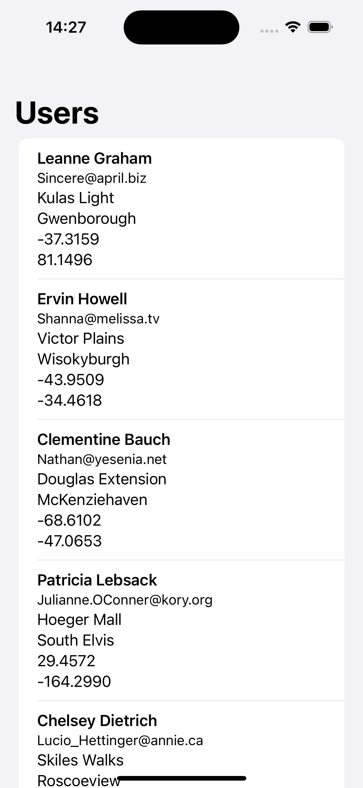

# SwiftUITutorial
これはSwiftUIを学ぶためのチュートリアルです。学習内容は気になったことをやっていきます。

**まずやること**
1. Arrayの使い方.
2. Foreachとは?
3. 画面遷移を理解する.
4. 次のページに値を渡す.

## API通信をやってみる
SwiftUIはCombineを使用して、API通信を行うことが多い。JsonPlaceFolderという無料のAPIを使って、ネストしたJSONからデータを取得するのをやってみようと思う。

https://jsonplaceholder.typicode.com/users

JSONに合わせてモデルを構造体で定義する。

このコードは、SwiftUIとCombineを使用してAPIからユーザー情報を取得し、それを表示するものです。以下に、各部分の詳細な説明を示します。

構造体（User, Address, Geo）: これらの構造体は、APIから取得するJSONデータをデコードするためのモデルです。Codableプロトコルを採用しているため、JSONデータをこれらの型にデコードできます。Identifiableプロトコルは、各ユーザーを一意に識別するために使用されます。
```swift
struct User: Codable, Identifiable {
    let id: Int
    let name: String
    let username: String
    let email: String
    let address: Address
}

struct Address: Codable {
    let street: String
    let suite: String
    let city: String
    let zipcode: String
    let geo: Geo
}

struct Geo: Codable {
    let lat: String
    let lng: String
}
```

----

CodableはSwiftのプロトコルで、クラスや構造体が自動的にデータのエンコードとデコードを行うことを可能にします。これは主にJSONやPlistなどのデータ形式との間で変換を行う際に使用されます。

CodableはEncodableとDecodableの二つのプロトコルを組み合わせたもので、エンコード（データへの変換）とデコード（データからの変換）の両方をサポートします。

例えば、以下のようなUser構造体があるとします。
```swift
struct User: Codable {
    var name: String
    var age: Int
}
```
このUser構造体はCodableプロトコルを採用しているため、JSONデータとの間で簡単に変換を行うことができます。
```swift
let user = User(name: "John", age: 30)

// エンコード（User -> JSON）
let encoder = JSONEncoder()
if let encodedData = try? encoder.encode(user) {
    // encodedDataはUserの情報を含むJSONデータです
}

// デコード（JSON -> User）
let decoder = JSONDecoder()
if let decodedUser = try? decoder.decode(User.self, from: encodedData) {
    // decodedUserはencodedDataからデコードされたUserインスタンスです
}
```

このように、Codableプロトコルを使用することで、データのエンコードとデコードを簡単に行うことができます。

UserViewModel: このクラスは、APIからデータを取得し、それをUser型の配列として公開する役割を果たします。ObservableObjectプロトコルを採用しているため、users配列に変更があったときに、それを購読しているViewに通知します。fetchUsersメソッドは、APIからデータを非同期に取得し、それをUser型の配列にデコードします。取得したデータは、users配列に保存されます。
```swift
class UserViewModel: ObservableObject {
    @Published var users: [User] = []
    private var cancellables = Set<AnyCancellable>()
    
    init() {
        fetchUsers()
    }
    
    func fetchUsers() {
        guard let url = URL(string: "https://jsonplaceholder.typicode.com/users") else {
            print("Invalid URL")
            return
        }
        
        URLSession.shared.dataTaskPublisher(for: url)
            .map(\.data)
            .decode(type: [User].self, decoder: JSONDecoder())
            .receive(on: DispatchQueue.main)
            .sink(receiveCompletion: { completion in
                if case .failure(let err) = completion {
                    print("Error: \(err)")
                }
            }, receiveValue: { [weak self] users in
                self?.users = users
            })
            .store(in: &cancellables)
    }
}
```

HttpRequestView: このViewは、UserViewModelから取得したユーザー情報を表示します。@ObservedObjectプロパティラッパーを使用して、UserViewModelのインスタンスを監視します。UserViewModelのusers配列に変更があったときに、Viewは自動的に更新されます。NavigationViewとListを使用して、各ユーザーの情報をリスト形式で表示します。

```swift
struct HttpRequestView: View {
    @ObservedObject var viewModel = UserViewModel()
    
    var body: some View {
        NavigationView {
            List(viewModel.users) { user in
                VStack(alignment: .leading) {
                    Text(user.name)
                        .font(.headline)
                    Text(user.email)
                        .font(.subheadline)
                    Text(user.address.street)
                    Text(user.address.city)
                    Text(user.address.geo.lat)
                    Text(user.address.geo.lng)
                }
            }
            .navigationTitle("Users")
        }
    }
}
```

このように、このコードはMVVM（Model-View-ViewModel）パターンを採用しています。User構造体がModel、HttpRequestViewがView、UserViewModelがViewModelの役割を果たしています。

実行結果:
